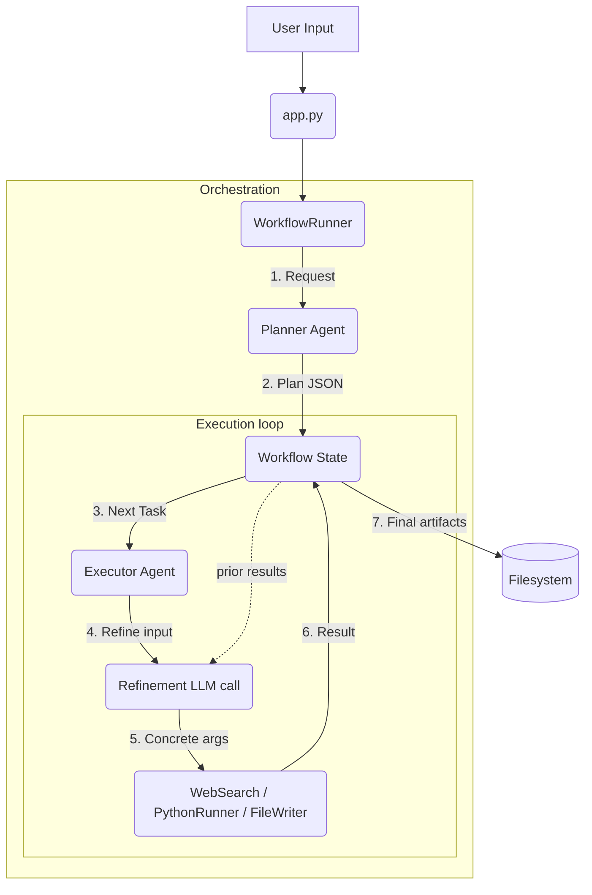

# ai-workflow-orchestrator

Agentic workflow runner that separates planning from execution. A planner LLM generates a structured task list; an executor refines tool inputs with prior-step context before each tool call.

## Problem

Single-shot agentic loops (planner = executor = same LLM call) lose information between steps. Tools end up being called with abstract, planner-stage arguments ("write summary of findings") even when the actual content from prior steps is what's needed.

## Solution

Two-phase orchestration with an explicit refinement step:

1. **Planner** — generates a static `Plan` of `Task`s with tool, intent, and placeholder inputs
2. **Workflow runner** — iterates through tasks, accumulates results in `State`
3. **Executor** — before running a tool, checks if the task needs context. If yes, calls the LLM again to refine the placeholder input using prior-step results
4. **Tools** — web search, Python runner, file writer. All side effects go through them.

## Architecture



## Stack

Python 3.11 · Azure OpenAI · Pydantic · DuckDuckGo Search (with fallback) · LLM-based input refinement

## Results

- End-to-end success rate on benchmark prompts: <METRIK>
- Tool-input quality (manual rating) before vs. after refinement: <METRIK>
- Average tokens per workflow run: <METRIK>
- Average cost per workflow run: <METRIK> USD

## Run

```bash
pip install -r requirements.txt
cp .env.example .env  # fill in Azure OpenAI keys
python app.py "your task here"
```

### Example prompts

1. **Full stack** (search + calc + write)
   > "Find the GDP of Germany and Japan for 2023. Compute the difference and the ratio in Python. Write a brief report to `economy_stats.md`."

2. **Deep compare** (multi-step synthesis)
   > "Compare LangChain and Semantic Kernel. Search for architecture, pros, and cons of each. Produce a structured comparison table in `framework_comparison.md`."

3. **Trace & investigate** (dependency chaining)
   > "Who is the current CEO of OpenAI? Find where they worked before. Look up that previous company's valuation. Write a career summary to `ceo_profile.md`."

4. **Research → code**
   > "Research the Factory Pattern in Python. Based on the research, write a working example implementation for a logistics application and save it as `factory_pattern.py`."

5. **Trend scout** (broad search + aggregation)
   > "Identify the top 3 AI trends for 2025. For each, find a startup working on it. Produce an investor memo `trends_2025.md` with a potential assessment."

## Project structure

```
ai-workflow-orchestrator/
├── app.py                       # CLI entry
├── workflows/
│   └── workflow_runner.py       # State machine + iteration
├── agents/
│   ├── planner.py               # Generates Plan + Tasks
│   └── executor.py              # Refines tool inputs, calls tools
├── memory/
│   └── state.py                 # Pydantic models: Plan, Task, Result
├── tools/
│   ├── web_search.py            # DuckDuckGo + mock fallback
│   ├── python_runner.py
│   └── file_writer.py
├── monitoring/                  # Per-run JSON report
├── config/
└── results/                     # Output artifacts
```

## Design choices

- **Two LLM calls per task** — once at plan time (cheap), once at refinement time (richer context). Avoids losing prior-step data.
- **State as a single source of truth** — every refinement can ask for any prior result without re-reading the filesystem.
- **Tools are pure** — they take fully-resolved arguments. No tool ever decides what to do based on stale plan data.
