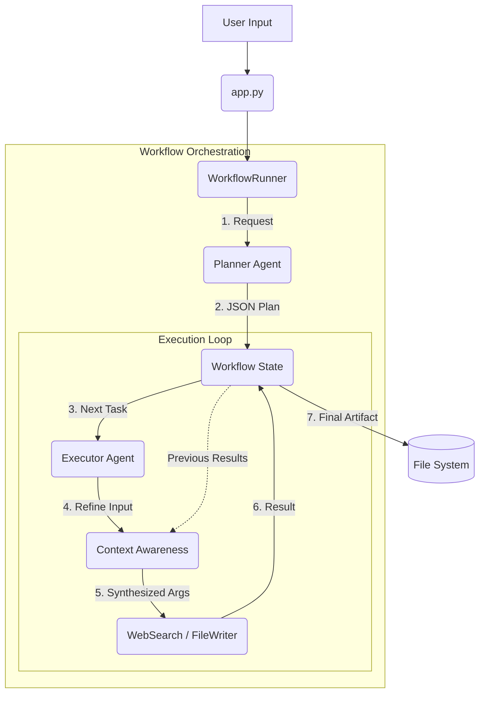

# AI Workflow Orchestrator

A modular system for orchestrating AI agents to plan and execute tasks using various tools.

## 🧠 Wie es funktioniert (Deep Dive)

Dieses System ist nicht nur eine einfache "Chain", sondern ein **Agentic Workflow**, der `Planung` von `Ausführung` trennt und `Kontext` intelligent nutzt.

### 🏗️ Architektur


### 🔄 Der Ablauf (Step-by-Step)

1.  **Entry Point (`app.py`)**:
    *   Nimmt den CLI-Command entgegen (z.B. "Research AI").
    *   Initialisiert den `WorkflowRunner`.

2.  **Planning Phase (`agents/planner.py`)**:
    *   Der Planner nutzt ein **Azure OpenAI Modell** mit einem strict System Prompt.
    *   Er zerlegt die Anfrage in logische Schritte (Tasks).
    *   **Besonderheit**: Er generiert nur *Platzhalter-Inputs* (z.B. "Write summary of findings"), kocht aber noch nicht den eigentlichen Text, da die Infos noch fehlen.

3.  **Execution Loop (`workflows/workflow_runner.py`)**:
    *   Der Runner iteriert durch die Tasks.
    *   Er sammelt die **Ergebnisse aller vorherigen Schritte** (`context`).

4.  **Refinement & Action (`agents/executor.py`)**:
    *   Hier passiert die Magie. Bevor ein Tool ausgeführt wird, prüft der Executor:
        *   *"Braucht dieses Tool Kontext?"* (z.B. `file_writer`).
    *   Falls ja, ruft er einen **internen LLM-Call** (`refine_tool_input`):
        *   Prompt: *"Hier sind die Suchergebnisse aus Schritt 1-3. Hier ist der Auftrag 'Schreibe Bericht'. Generiere den INHALT für die Datei."*
    *   Das LLM transformiert den abstrakten Plan in konkrete Tool-Argumente (Dateiname + echter Inhalt).

5.  **Tooling (`tools/`)**:
    *   **Web Search**: Nutzt DuckDuckGo (oder einen Mock-Fallback bei Import-Fehlern), um Daten zu beschaffen.
    *   **File Writer**: Schreibt das vom LLM generierte Ergebnis auf die Festplatte.

## 📂 Struktur

- **`app.py`**: Der "Knopf", den man drückt.
- **`workflows/workflow_runner.py`**: Der Dirigent. Hält den Status (`State`) und koordiniert Planner und Executor.
- **`agents/planner.py`**: Der Architekt. Denkt sich den Plan aus.
- **`agents/executor.py`**: Der Handwerker. Führt Tools aus und verfeinert Inputs (`Refinement`).
- **`memory/state.py`**: Das Gedächtnis. Pydantic Models für `Plan`, `Task`, `Result`.
- **`tools/`**: Die Werkzeugkiste (Search, File IO, Python).
- **`config/`**: Verwaltet API Keys und Settings.

## 🚀 How to Run

1.  **Dependencies installieren**:
    ```bash
    pip install -r requirements.txt
    ```
2.  **Environment Config**:
    Kopiere die `.env` und trage deine Azure OpenAI Keys ein.
3.  **Starten**:
    ```bash
    python app.py "Dein Task hier..."
    ```

### 💡 Beispiel-Szenarien (Prompts)

Hier sind einige Queries, die zeigen, was das System kann:

#### 1. Der "Full Stack" Test (Search + Calc + Write)
> "Finde das aktuelle Bruttoinlandsprodukt (BIP) von Deutschland und Japan für 2023. Nutze Python, um die Differenz und das Verhältnis in Prozent zu berechnen. Schreibe einen kurzen Bericht mit den Zahlen in 'economy_stats.md'."

#### 2. Der "Deep Compare" (Multi-Step Synthesis)
> "Vergleiche 'LangChain' und 'Semantic Kernel'. Suche nach Architektur, Vor- und Nachteilen für beide Frameworks im Detail. Erstelle eine strukturierte Vergleichstabelle in 'framework_comparison.md'."

#### 3. Der "Trace & Investigate" (Dependency Chaining)
> "Wer ist der aktuelle CEO von OpenAI? Finde heraus, wo er davor gearbeitet hat. Suche dann nach dem Aktienkurs oder der Bewertung dieser vorherigen Firma. Schreibe eine Karriere-Zusammenfassung in 'ceo_profile.md'."

#### 4. Der "Coding Architect" (Technical Research to Code)
> "Recherchiere das 'Factory Pattern' in Python. Schreibe basierend auf der Recherche eine funktionierende Python-Beispielimplementierung für eine Logistik-Software und speichere sie als 'factory_pattern.py'."

#### 5. Der "Trend Scout" (Broad Search & Aggregation)
> "Identifiziere die Top 3 AI-Trends für 2025. Suche für jeden Trend ein konkretes Startup, das daran arbeitet. Erstelle ein Investoren-Memo names 'trends_2025.md' mit einer Bewertung des Potenzials."

